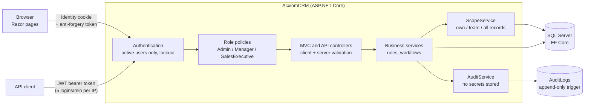
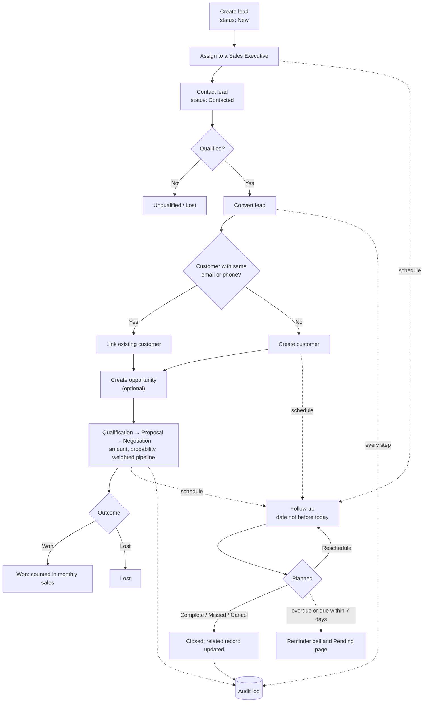

# AcxiomCRM

A role-based CRM web application for a sales organisation: customers, leads, opportunities, follow-ups, activities,
a sales pipeline dashboard, reports, a REST API and a tamper-proof audit log. Built with ASP.NET Core MVC, ASP.NET Core
Identity, Entity Framework Core and SQL Server.


## Features
- Sign-in runs on ASP.NET Core Identity: register, log in, log out and change your password. Passwords need at least 8 characters with an uppercase letter, a lowercase letter, a digit and a symbol. Five failed logins lock the account for 15 minutes, and admins can issue one-time password reset links.
- There are three roles. Admins can do everything, Managers see their own records and their team's, and Sales Executives see only their own or assigned records. The server checks this on every page, record and API call.
- The dashboard has KPI cards for customers, leads, open leads, opportunities (open, won and lost) and pipeline value, plus date filters. Chart.js charts show lead status, the opportunity pipeline and monthly sales.
- Customers can be created, edited, viewed, deactivated and searched. Email and phone must be unique, and each customer has a change history and a list of related activities.
- Leads move from New to Contacted, Qualified and Converted, or end as Unqualified or Lost. A qualified lead converts into a customer, plus an opportunity if you want one, in a single transaction.
- Opportunities go through Qualification, Proposal and Negotiation to Won or Lost. Each one has an amount and a probability, which give the weighted pipeline. There's also a sales pipeline board.
- Follow-ups can be scheduled, completed, marked missed, cancelled or rescheduled against a customer, lead or opportunity. Overdue and upcoming ones show up in the header bell.
- Activities log calls, meetings, emails and tasks against customers and leads.
- Reports cover customers, leads, follow-ups, opportunities, the pipeline, sales and conversion, user activity and the audit log, all with filters, sorting and paging.
- The audit log records logins, failed logins, lockouts, password and role changes, and every create, update, delete and workflow event. It's append-only, and a database trigger enforces that.
- The REST API is secured with JWT and covers customers, leads, opportunities, follow-ups and the pipeline report. See `docs/API.md`.
- Validation happens in the browser (unobtrusive validation) and again on the server, with business rules such as: opportunity amount must be greater than 0, probability must be between 0 and 100, and close dates and follow-up dates can't be in the past.

## How it works

### Request flow

Every page and API call goes through the same authentication, authorization and business services, so the web UI and
the REST API always apply identical rules, scope and auditing.



### CRM workflow



## Screenshots

| | |
|---|---|
|  |  |
| Customers with search and filters | Leads across every status |
|  |  |
| Sales pipeline with weighted amounts | Overdue and upcoming follow-up reminders |

All screenshots use synthetic demo data.

## Roles

| Module | Admin | Manager | SalesExecutive |
|---|---|---|---|
| Dashboard, customers, leads, opportunities, follow-ups, activities | All records | Own and team records | Own/assigned records |
| Users | Full administration | View team (read-only) | No access |
| Roles and permissions | Full | No access | No access |
| Audit log | Full | No access (configurable: team, read-only) | No access |
| Reports | All | Team | Own |
| REST API | All records | Team records | Own records |

A team is a Manager plus the SalesExecutives whose manager is set to them (set by an Admin on the user page).
Self-registered users become active SalesExecutives.

## Tech stack

.NET 10, ASP.NET Core MVC with Razor views, ASP.NET Core Identity, Entity Framework Core with SQL Server, JWT bearer
authentication for the API, Bootstrap 5, jQuery unobtrusive validation and Chart.js 4. Tests use xUnit with
WebApplicationFactory against a real SQL Server database.

## Getting started

### Prerequisites

- [.NET 10 SDK](https://dotnet.microsoft.com/download)
- SQL Server (Express, LocalDB or full). The examples use `.\SQLEXPRESS` with Windows authentication.

### 1. Restore tools and packages

```bash
git clone https://github.com/ruthvikparimi2006/AcxiomCRM.git
cd AcxiomCRM
dotnet tool restore        # installs dotnet-ef from dotnet-tools.json
dotnet restore
```

### 2. Configure secrets with user-secrets

Secrets are never stored in the repository. For local development, store them with
[user-secrets](https://learn.microsoft.com/aspnet/core/security/app-secrets):

```bash
cd src/AcxiomCRM
dotnet user-secrets set "ConnectionStrings:DefaultConnection" "Server=.\SQLEXPRESS;Database=AcxiomCRM;Trusted_Connection=True;TrustServerCertificate=True;MultipleActiveResultSets=true"
dotnet user-secrets set "Jwt:Key" "<a random string of at least 32 characters>"
dotnet user-secrets set "Seed:AdminEmail" "admin@example.com"
dotnet user-secrets set "Seed:AdminPassword" "<a password meeting the policy, e.g. Admin#Pass123>"
cd ../..
```

| Setting | Purpose |
|---|---|
| `ConnectionStrings:DefaultConnection` | SQL Server database (required) |
| `Jwt:Key` | Signs REST API tokens; at least 32 characters (required) |
| `Seed:AdminEmail`, `Seed:AdminPassword` | Creates the first Admin on startup if no Admin exists |

### 3. Create the database

```bash
dotnet ef database update --project src/AcxiomCRM
```

This applies all EF Core migrations, including the trigger that makes the audit log append-only.

### 4. Run

```bash
dotnet run --project src/AcxiomCRM
```

Open the HTTPS URL shown in the console (trust the development certificate once with `dotnet dev-certs https --trust`),
then sign in with the seeded Admin. From **Users** you can create Managers and SalesExecutives, assign each
SalesExecutive to a Manager, and give new users a one-time link to set their password.

## Testing

```bash
dotnet test
```

The suite (310 tests) runs the real application against a throwaway SQL Server database named `AcxiomCRM_Tests`, which
it creates and deletes automatically. It covers authentication, authorization and scope, validation (including crafted
requests), every module, the four CRM workflows, the audit log, the REST API, dashboard and reports, and production
settings. To use a different server, set the `ACXIOMCRM_TEST_DB` environment variable to a connection string.

How each requirement is verified is recorded in [docs/ACCEPTANCE.md](docs/ACCEPTANCE.md).

## REST API

Authenticate with `POST /api/auth/login` and send the returned token as `Authorization: Bearer <token>`. Tokens last
60 minutes, and login is limited to 5 attempts per minute per IP address. Endpoints, request rules and error formats
are documented in [docs/API.md](docs/API.md).

```bash
curl -k -X POST https://localhost:<port>/api/auth/login -H "Content-Type: application/json" \
     -d '{"login":"admin@example.com","password":"<password>"}'
curl -k https://localhost:<port>/api/customers -H "Authorization: Bearer <token>"
```

## Project structure

```text
src/AcxiomCRM/
  Controllers/        MVC controllers; Api/ holds the REST API controllers
  Data/               EF Core DbContext, seeding and migrations
  Dtos/               API request/response models
  Models/             Entities, enums, roles and policies
  Services/           Business rules, scope, audit, login and token services
  ViewComponents/     Header notifications (follow-up reminders)
  ViewModels/         Form and page models, validation rules
  Views/              Razor views
  wwwroot/            CSS, JavaScript and client libraries
tests/AcxiomCRM.Tests/  Automated tests
docs/                 API reference, acceptance record, deployment guide, screenshots
```

## Deployment

Production configuration (environment variables, HTTPS/HSTS, reverse proxy, data-protection keys, least-privilege
database login and an idempotent migration script) is described in [docs/DEPLOYMENT.md](docs/DEPLOYMENT.md).
